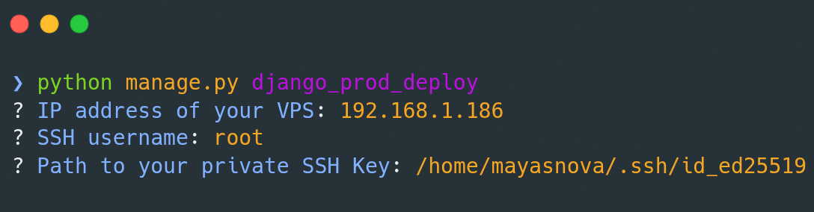

# django-prod

Quickly deploy over SSH your newly generated django project.

---

This package provides two management commands:

- `django_prod_init` — generates all production files you need.
- `django_prod_deploy` — deploys your project to a remote SERVER over SSH.

---

## 📦 Installation

Install the package:

```bash
pip install django-prod
```

---

## 🛠 Example

Create a new django project:

```bash
django-admin startproject webapp .
```

Add django-prod to installed apps:
```bash
# settings.py
INSTALLED_APPS = [
    ...
    "django_prod",
]
```

Initialize production files:
```bash
python manage.py django_prod_init
```

Deploy to your server:
```bash
python manage.py django_prod_deploy
```
You will be prompted for:

- Server IP address
- SSH username
- Path to your SSH private key



Then the script will:

- Upload your project to the server
- Ensure Docker is installed
- Run your production stack with Docker Compose

---

This project is **opinionated** and uses the simplest technologies possible to move from development to production quickly.
It relies on **SQLite** as the production database, and for those who still consider SQLite a “toy database,” I strongly encourage you to look into its performance when properly configured. That’s why the project includes a dedicated configuration to get the most out of SQLite (see **settings_prod.py**).

It also uses **WhiteNoise** to handle static files. Performance is more than acceptable once assets are cached and served through a CDN (for example, a Cloudflare proxy).

The third technology used is **Docker** and **Docker Compose**. no need to explain why :)

